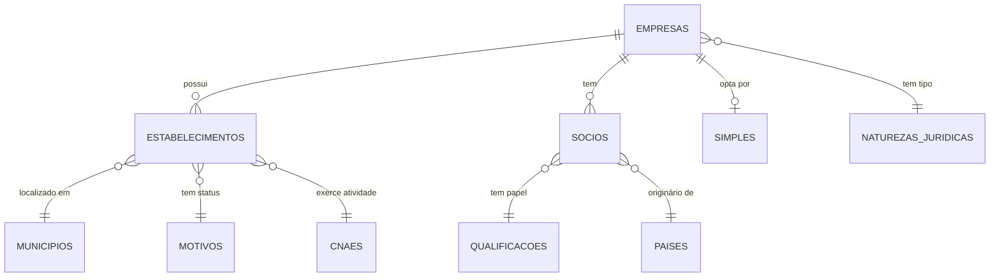

# CNPJ Data Schema

Layout dos arquivos CSV disponibilizados pela Receita Federal.

## Relacionamentos

> **Nota:** Dados históricos podem ter inconsistências legítimas (códigos de município antigos, CNAEs desativados, etc.). Evite forçar integridade referencial completa.

## Formato dos Arquivos

| Propriedade | Valor |
|-------------|-------|
| Encoding | ISO-8859-1 |
| Separador | `;` (ponto e vírgula) |
| Datas nulas | `0` ou `00000000` |
| Atualização | Mensal |

## Tabelas Principais

### empresas

| Campo | Descrição |
|-------|-----------|
| cnpj_basico | 8 primeiros dígitos do CNPJ |
| razao_social | Nome empresarial |
| natureza_juridica | Código → naturezas_juridicas |
| qualificacao_responsavel | Código → qualificacoes_socios |
| capital_social | Capital social (formato brasileiro: `1.234,56`) |
| porte | Código do porte |
| ente_federativo | Preenchido apenas para natureza jurídica 1XXX |

**Códigos de porte:**
- `00` - Não informado
- `01` - Microempresa
- `03` - Empresa de Pequeno Porte
- `05` - Demais

### estabelecimentos

| Campo | Descrição |
|-------|-----------|
| cnpj_basico | 8 primeiros dígitos |
| cnpj_ordem | 4 dígitos (0001=matriz) |
| cnpj_dv | 2 dígitos verificadores |
| identificador_matriz_filial | 1=Matriz, 2=Filial |
| nome_fantasia | Nome fantasia |
| situacao_cadastral | Código da situação |
| data_situacao_cadastral | Data do evento |
| motivo_situacao_cadastral | Código → motivos |
| nome_cidade_exterior | Se domiciliado no exterior |
| pais | Código → paises |
| data_inicio_atividade | Data de abertura |
| cnae_fiscal_principal | Código → cnaes |
| cnae_fiscal_secundaria | Códigos separados por vírgula |
| tipo_logradouro | RUA, AV, etc. |
| logradouro | Nome da rua |
| numero | Número ou S/N |
| complemento | Complemento |
| bairro | Bairro |
| cep | CEP |
| uf | Sigla do estado |
| municipio | Código → municipios |
| ddd1, telefone1 | Contato 1 |
| ddd2, telefone2 | Contato 2 |
| ddd_fax, fax | Fax |
| correio_eletronico | E-mail |
| situacao_especial | Situação especial |
| data_situacao_especial | Data da situação especial |

**Códigos de situação cadastral:**
- `01` - Nula
- `02` - Ativa
- `03` - Suspensa
- `04` - Inapta
- `08` - Baixada

### socios

| Campo | Descrição |
|-------|-----------|
| cnpj_basico | 8 primeiros dígitos |
| identificador_de_socio | Tipo do sócio |
| nome_socio | Nome (PF) ou Razão Social (PJ) |
| cnpj_cpf_do_socio | CPF mascarado ou CNPJ |
| qualificacao_do_socio | Código → qualificacoes_socios |
| data_entrada_sociedade | Data de entrada |
| pais | Código → paises (se estrangeiro) |
| representante_legal | CPF do representante |
| nome_do_representante | Nome do representante |
| qualificacao_representante_legal | Código → qualificacoes_socios |
| faixa_etaria | Código da faixa etária |

**Códigos de identificador de sócio:**
- `1` - Pessoa Jurídica
- `2` - Pessoa Física
- `3` - Estrangeiro

**Códigos de faixa etária:**
- `0` - Não se aplica
- `1` - 0-12 anos
- `2` - 13-20 anos
- `3` - 21-30 anos
- `4` - 31-40 anos
- `5` - 41-50 anos
- `6` - 51-60 anos
- `7` - 61-70 anos
- `8` - 71-80 anos
- `9` - 80+ anos

**Mascaramento de CPF:** Os 3 primeiros e 2 últimos dígitos são ocultados (`***XXXXXX**`).

### dados_simples

| Campo | Descrição |
|-------|-----------|
| cnpj_basico | 8 primeiros dígitos |
| opcao_pelo_simples | S=Sim, N=Não, vazio=Outros |
| data_opcao_simples | Data de opção |
| data_exclusao_simples | Data de exclusão |
| opcao_pelo_mei | S=Sim, N=Não, vazio=Outros |
| data_opcao_mei | Data de opção |
| data_exclusao_mei | Data de exclusão |

## Tabelas de Referência

| Tabela | Campos |
|--------|--------|
| cnaes | codigo, descricao |
| motivos | codigo, descricao |
| municipios | codigo, descricao |
| naturezas_juridicas | codigo, descricao |
| paises | codigo, descricao |
| qualificacoes_socios | codigo, descricao |

## Fonte Oficial

- **Download**: https://arquivos.receitafederal.gov.br/dados/cnpj/dados_abertos_cnpj/
- **Layout CSV**: https://www.gov.br/receitafederal/dados/cnpj-metadados.pdf
- **Nota Técnica 47/2024**: https://www.gov.br/receitafederal/dados/nota_cocad_no_47_2024.pdf/
- **Nota Técnica 86/2024**: https://www.gov.br/receitafederal/dados/nota-cocad-rfb-86-2024.pdf/
